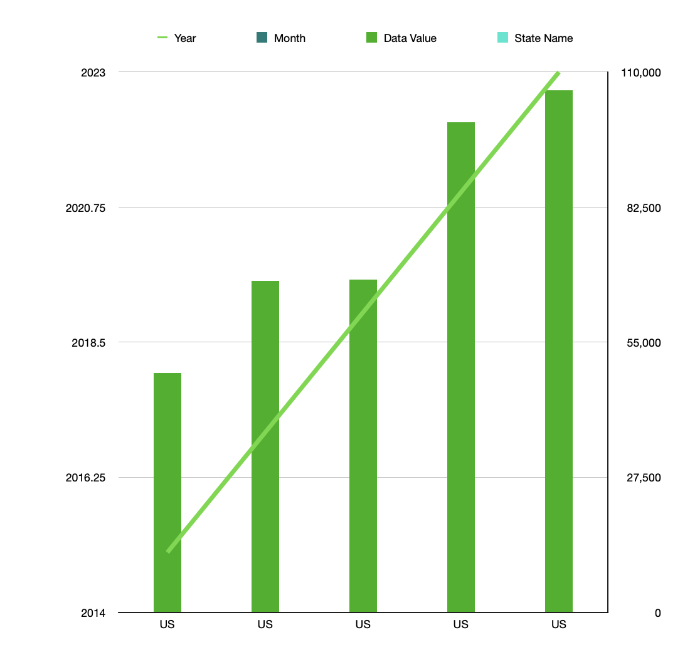

# Spreadsheet Analysis

This data is from [The CDC, Provisional Drug Overdose Death Counts
from April 2015-March 2023](https://www.cdc.gov/nchs/nvss/vsrr/drug-overdose-data.htm).

The original data was CSV format.

## Snippet of OG Data
| State | Year | Month    | Period         | Indicator                                           | Data Value | Percent Complete | Percent Pending Investigation | State Name | Footnote                                           | Footnote Symbol | Predicted Value |
|-------|------|----------|-----------------|----------------------------------------------------|------------|-------------------|-------------------------------|------------|----------------------------------------------------|-----------------|-----------------|
| AK    | 2015 | April    | 12 month-ending | "Natural, semi-synthetic, & synthetic opioids, incl. methadone (T40.2-T40.4)" |            | 100               | 0                             | Alaska     | Numbers may differ from published reports using final data. See Technical Notes.  Data not shown due to low data quality. | **              |                 |
| AK    | 2015 | April    | 12 month-ending | "Synthetic opioids, excl. methadone (T40.4)"       |            | 100               | 0                             | Alaska     | Numbers may differ from published reports using final data. See Technical Notes.  Data not shown due to low data quality. | **              |                 |
| AK    | 2015 | April    | 12 month-ending | Heroin (T40.1)                                     |            | 100               | 0                             | Alaska     | Numbers may differ from published reports using final data. See Technical Notes.  Data not shown due to low data quality. | **              |                 |
| AK    | 2015 | April    | 12 month-ending | Cocaine (T40.5)                                   |            | 100               | 0                             | Alaska     | Numbers may differ from published reports using final data. See Technical Notes.  Data not shown due to low data quality. | **              |                 |
| AK    | 2015 | April    | 12 month-ending | Number of Drug Overdose Deaths                    | 126        | 100               | 0                             | Alaska     | Numbers may differ from published reports using final data. See Technical Notes. | **              | 126             |
| AK    | 2015 | April    | 12 month-ending | "Natural & semi-synthetic opioids, incl. methadone (T40.2, T40.3)" |            | 100               | 0                             | Alaska     | Numbers may differ from published reports using final data. See Technical Notes.  Data not shown due to low data quality. | **              |                 |

## Changes to OG Data
The first thing I added was a column to point out if the overdose was from synthetic opioids or not, differentiating with "Yes", "No", or "Data Value" to indicate that that specific row is not an individual instance of an overdose, but rather a row that displays the total number of deaths in that state thus far, for example.

## Problems
At first, my code to create this new synthetic/non-synthetic overdose column did not account for rows that were merely totals instead of individual instances. This was quickly accounted for by identifying if the indicator row started with "Number" or "Percent" instead of "Synthetic" or "Natural", the latter 2 being the identifying characteristics of synthetic opioids, AKA a "Yes" in the Synthetic column. This allowed me to create many more aggregate statistics in my actual spreadsheet, and I was able to subtract the "Data Values" from the actual individual instances. 

## Data Links

[The OG Raw Data](data/data.csv)
[The Munged Data](data/clean_data.csv)
[The Spreadsheet](data/clean_data.numbers)

## Aggregate Statistics
I obtained the total number of synthetic opioid overdoses within the dataset by a conditional COUNTIF formula, looking for "Yes" in the synthetic/semi-synthetic column. I did the same for non-synthetic overdoses with the same function, but with "No". Then, using the same formula, I obtained the count of "Data Values" in the indicator column within the dataset, which did not represent individual overdose instances. With this foundation, I then calculated the percent of synthetic opioid overdoses and non-synthetic. I found the minimum and maximum number of drug overdose deaths in the US total by utilizing a conditional MINIFS & MAXIFS function.

## Chart Visualization

This chart shows the upwards trend of overdose deaths in the US, from April 2015 to April 2023 with a step of 2 years.

## Extra-credit

I believe this assignment deserves extra credit for two reasons. This is a large dataset with 60,001 rows. It is extensive and spans from January 2015- March 2023, detailing each instance of an overdose death in each state, as well as the type of drug that caused the overdose. This data is meaningful to me because I lost my 23-year-old brother in September 2022 due to being synthetically laced with Fentanyl unbeknownst to him. I specifically added a column in this dataset to quickly check if the death was caused by a synthetic or semi-synthetic opioid for this reason- it is truly plaguing the country and taking the lives of so many, young or old. I actually took Database Design to aid me in creating my own online database for a product I have designed and conceptually created, a handheld Raman Spectrometer Shield Keychain to instantly test pills/substances for synthetic opioids, it utilizes an online database and checks for the unique spectral signature of Fentanyl and other common synthetic opioids. So, for this reason, I believe this assignment deserves extra credit. I hope to take away what I learn in this class to aid me in my endeavors and potentially lower the number of accidental deaths.
